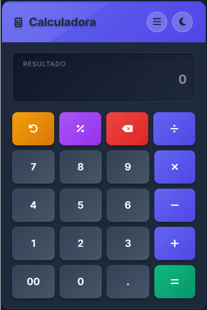
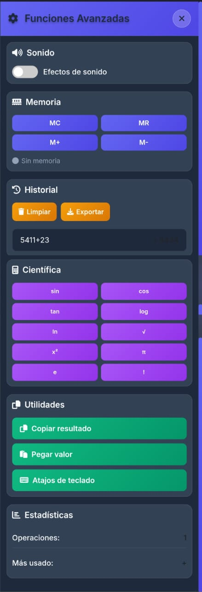
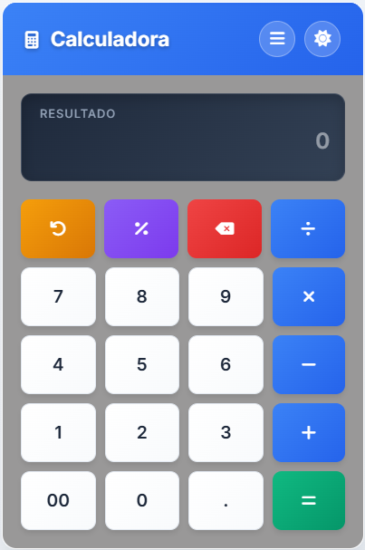

# 🧮 Calculadora Web Avanzada

 
  

## 📌 Descripción

**Calculadora web avanzada** desarrollada con **HTML5, CSS3 y JavaScript ES6+**, integrando **Bootstrap 5** y **Font Awesome** para una experiencia de usuario moderna y profesional. Incluye funcionalidades científicas, historial de cálculos, funciones de memoria, efectos de sonido y vibración, y un sistema completo de temas claro/oscuro.

---

## 🚀 Demo en Vivo

🔗 [https://jonaaxsic.github.io/Calculadora/](https://jonaaxsic.github.io/Calculadora/)

---

## ✨ Características Principales

### 🧮 **Funcionalidades Básicas**

- ✅ **Operaciones aritméticas**: suma, resta, multiplicación, división
- ✅ **Soporte completo de teclado** (números, operadores, Enter, Escape)
- ✅ **Validación de entrada** inteligente
- ✅ **Formateo automático** de números grandes
- ✅ **Símbolos visuales** (÷, ×) en lugar de operadores técnicos

### 🔬 **Calculadora Científica**

- ✅ **Funciones trigonométricas**: sin, cos, tan
- ✅ **Logaritmos**: log, ln
- ✅ **Raíz cuadrada**: √
- ✅ **Potencia al cuadrado**: x²
- ✅ **Constantes matemáticas**: π, e
- ✅ **Factorial**: !

### 🧠 **Funciones de Memoria**

- ✅ **MC (Memory Clear)**: Limpiar memoria
- ✅ **MR (Memory Recall)**: Recuperar valor
- ✅ **M+ (Memory Add)**: Sumar a memoria
- ✅ **M- (Memory Subtract)**: Restar de memoria
- ✅ **Indicador visual** del estado de memoria

### 📊 **Historial y Estadísticas**

- ✅ **Historial completo** de cálculos (últimos 50)
- ✅ **Reutilización** de resultados anteriores
- ✅ **Exportación a CSV** con timestamps
- ✅ **Estadísticas de uso** en tiempo real
- ✅ **Operación más utilizada**

### 🎵 **Efectos Multimedia**

- ✅ **Efectos de sonido** sintéticos (click, calculate, error)
- ✅ **Vibración háptica** en dispositivos móviles
- ✅ **Toggle de sonido** con persistencia
- ✅ **Notificaciones** de confirmación

### 📋 **Utilidades Avanzadas**

- ✅ **Copiar resultado** al portapapeles
- ✅ **Pegar valor** desde portapapeles
- ✅ **Modal de atajos** de teclado
- ✅ **Persistencia de datos** en localStorage

---

## 🎯 Capturas de Pantalla

### Vista Principal

### Funciones Avanzadas

### Modo Claro

### Modo Oscuro

---

## 🛠️ Tecnologías Utilizadas

### **Frontend Core**

- **HTML5** - Estructura semántica
- **CSS3** - Estilos avanzados con variables CSS
- **JavaScript ES6+** - Lógica de aplicación

### **Frameworks y Librerías**

- **Bootstrap 5.3.0** - Sistema de grid y componentes
- **Font Awesome 6.4.0** - Iconografía completa
- **Google Fonts (Inter)** - Tipografía moderna

### **APIs Web**

- **Web Audio API** - Efectos de sonido sintéticos
- **Vibration API** - Feedback háptico
- **Clipboard API** - Copiar/pegar
- **localStorage** - Persistencia de datos

---

## 🎨 Temas Disponibles

### **Modo Claro**

- Fondo: Gradiente azul-gris claro
- Botones: Blanco con gradientes sutiles
- Operadores: Azul profesional
- Borrado: Naranja vibrante
- Igual: Verde éxito

### **Modo Oscuro**

- Fondo: Gradiente azul-gris oscuro
- Botones: Gris oscuro con gradientes
- Operadores: Índigo profundo
- Mismos colores de acento que modo claro

---

## 🔧 Funcionalidades Técnicas

### **Gestión de Estado**

- **Persistencia** de configuración en localStorage
- **Historial** mantenido entre sesiones
- **Memoria** preservada al recargar
- **Preferencias** de sonido recordadas

### **Rendimiento**

- **Límite de historial** (50 cálculos) para optimización
- **Lazy loading** de funcionalidades avanzadas
- **Event delegation** para mejor rendimiento
- **Debouncing** en validaciones

### **Accesibilidad**

- **Soporte completo** de teclado
- **ARIA labels** en botones
- **Focus management** mejorado
- **Contraste** optimizado para ambos temas

---

© 2025 

